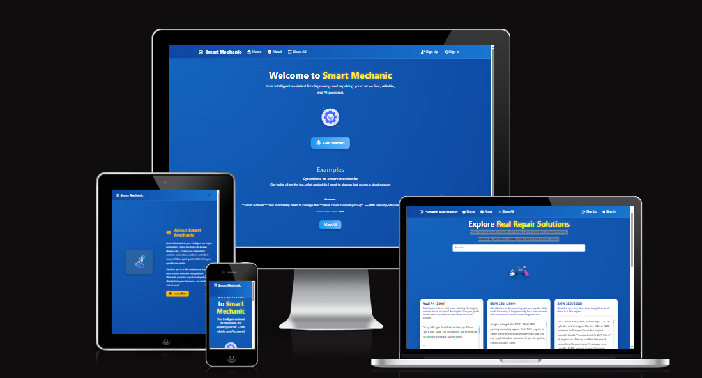
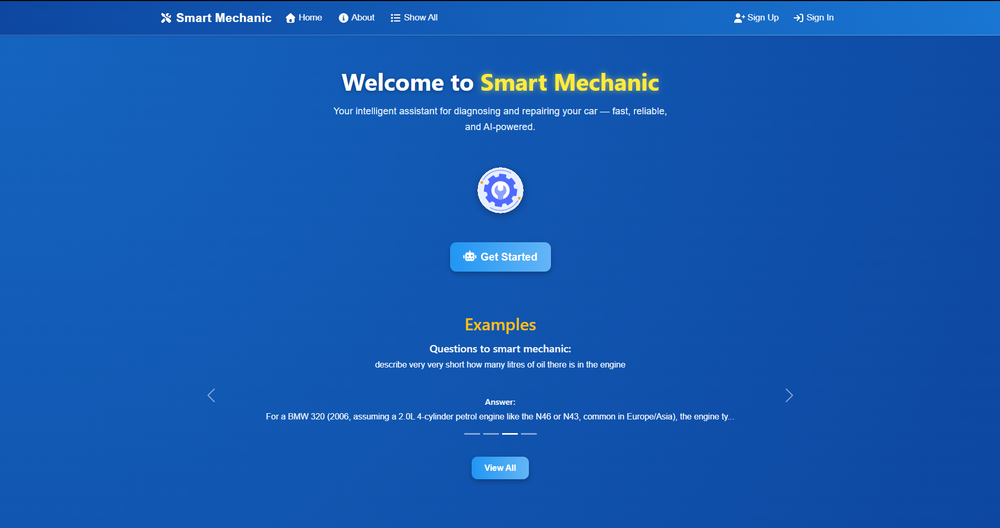
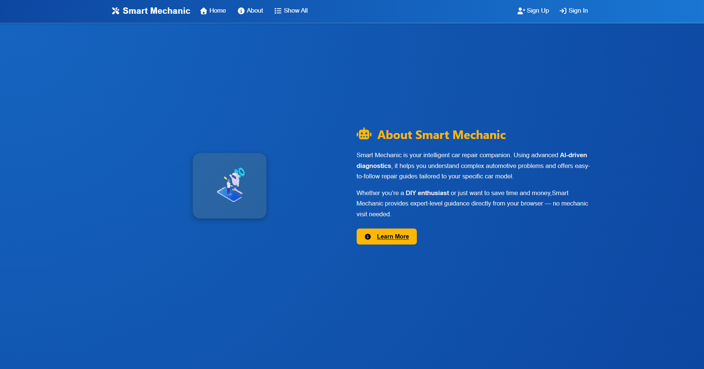
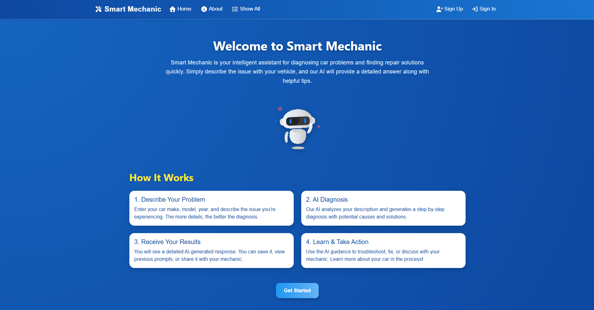
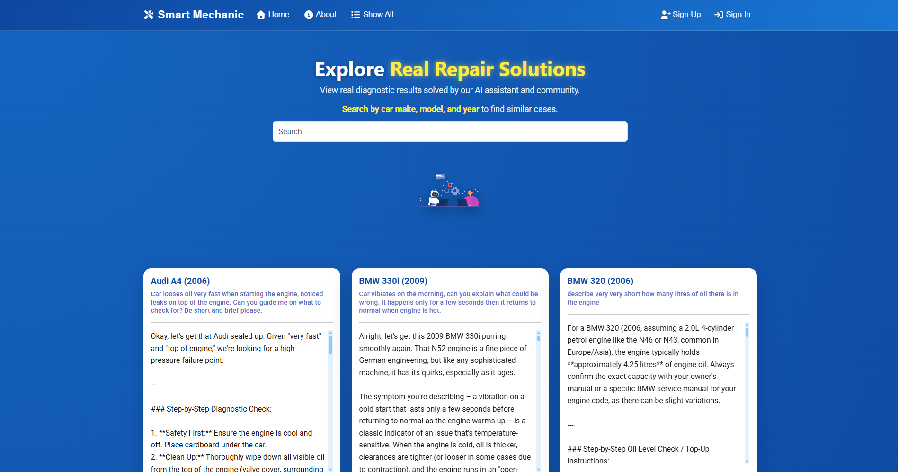
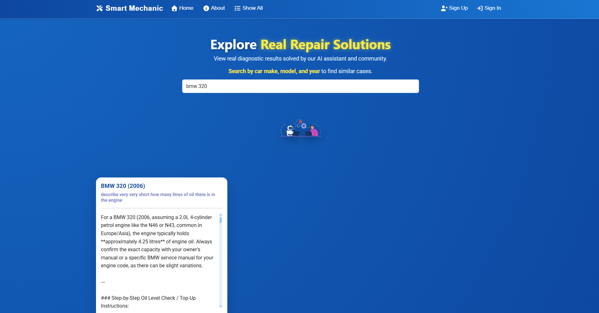
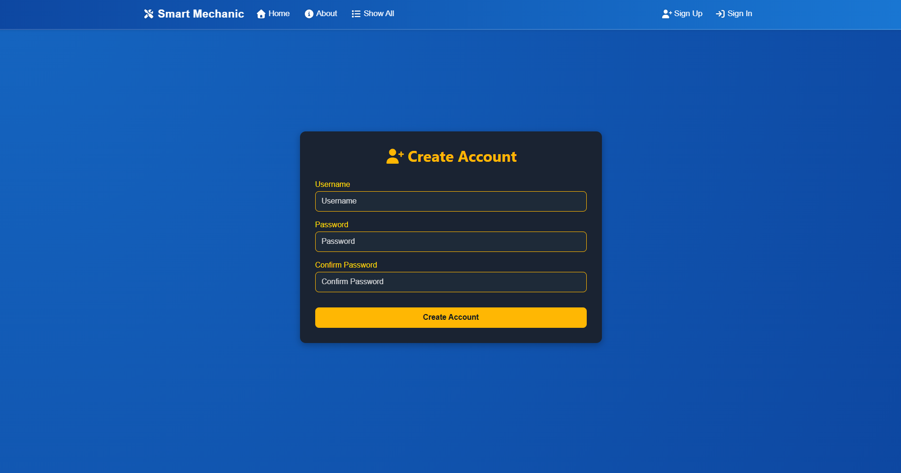
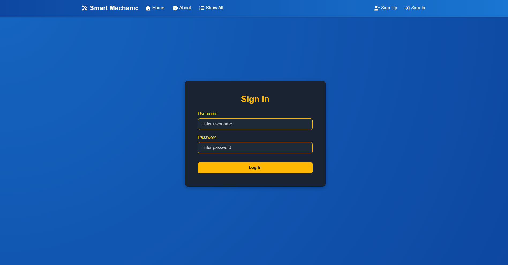
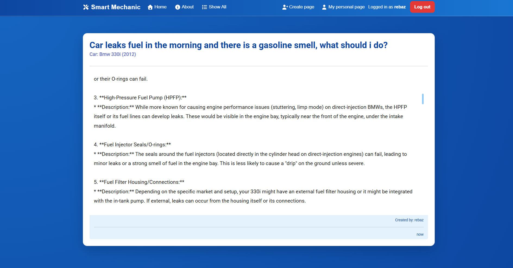
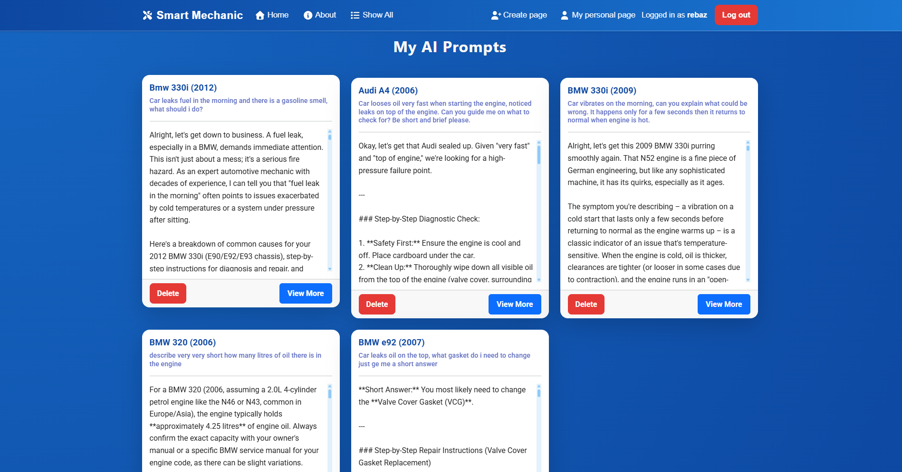

# Smart mechanic

Mechanic AI is a dedicated automotive diagnostic assistant designed for car owners, enthusiasts, and DIY mechanics. Instead of using a general-purpose chatbot like ChatGPT or Gemini, Mechanic AI is trained specifically on automotive systems, fault symptoms, repair procedures, and common failure patterns across many car makes, models, and years.

Users can describe a problem in their own words, and Mechanic AI will return a clear, step-by-step diagnostic and repair plan — written in a way that is practical, safe, and easy to follow. The platform also allows you to save, organize, and revisit all of your personal diagnostic requests, making it easier to track repairs over time.

In addition, Mechanic AI includes a shared knowledge base where you can browse real diagnostic cases submitted by other users, complete with symptoms, causes, and repair solutions. You can search this library by car make, model, year, and keywords, helping you quickly find cases similar to your own and avoid repeating hours of guesswork.

# Website link

* [Mechanic Ai](https://ai-mechanic-front-e8deb33d9023.herokuapp.com/)

# User stories

* As a user, I want to submit a car problem to Mechanic AI, so that I can get expert step-by-step repair instructions.

* As a user, I want to view my past diagnostic requests on a personal page, so that I can track and manage all my car issues in one place.

* As a user, I want to search other users’ diagnostic results by car make, model, and year, so that I can find similar problems and solutions.

* As a user, I want to see a public page with all diagnostic requests and AI solutions, so that I can learn from other users’ experiences.

* As a user, I want the AI to only answer car-related questions, so that I receive relevant and accurate advice.

* As a user, I want the AI solutions to include estimated costs, common causes, and DIY-friendly steps, so that I can plan repairs efficiently and confidently.

# Features and functionality

## Home page

User will be welcomed with a short intro text that will encoruage the user to see all the reviews. There is a dynamic navbar that changes based on if the user is logged in or out. Below the intro text there is a carousel with arrow that displays:

## About page

User will be informed on what the page is about, if user clicks learn more the user will be redirected to how the page works.

## Learn more page

Here user will be informed how the webpage work and also a get started button is there to encourage user to click on it and create account.

## Show all page

Here user can view all the diagonose request from other users, on the top there is a serach function. A spinner will load when request is being made.

## Search page

User can input, carmake, model and year. It will display the relevant request to the Smart mechanic. User can also input text like: "Car leaks oil" and it will display relevant card.

## Create account page

User can create an account, if user input incorrect info in the fileds message will be displayed. When user creates account link will appear to log in.

## Log in page

User can log in here, when user puts incorrect data message will be displayed to inform user.

## Navbar
The navbar displays diffrent links depending on if the user is logged in or not.

## Logged in user

## Not logged in user

## Create request diagnose page

When user is logged in the user can create a request to the smart mechanic, a message will appear that the smart mechanic is thinking and analyzing the input data.

## View more page

After the smart mechanich have finished analyzing the data, user will be redirected to the page where all the relevant information is displayed.

## My personal page
Here user can display all the earlier request that have been made to the smart mechanic. User can also delete the prompts.

## Footer
Here diffrent links and information is displayed.

## Technology
* The structure of the webpage was created with HTML5.

* The styling was created with CSS3.

* Bootstrap version 5.3.8 was used for the styling of this project. And   React bootstrap: "2.10.10"

* React version 19.2.0 was used for this project.

* React-router-dom version 7.9.5 is used as navigation and clicking links in the navbar.

* Axios version 1.13.1 is installed to fetch the api endpoints.

## API backend endpoint
The documentation for the backend can be found her: [repository](https://github.com/rebahama/drf_ai_backend)

## Supported screens
* Ipad Air/Ipad Mini.

* Iphone 4 to 17

* Samsung Galaxy S8/S20.

* Nesthub Max.

## Deployment
* When creating the app use the command: npx create-react-app. then "npm start".

* In Heroku hompage click on "create app".

* After you have created the app then click on "deploy".

* Click on github as deployment method and connect your github account to your Heroku account.

* Click on deploy branch and your app should start be live after a few minutes.

## Source code
1. Go to this repository [repository](https://github.com/rebahama/rebahama-ai-mechanic-frontend)

2. Click on the green button texted "Code"

3. Type npm start to get the server up and running.
